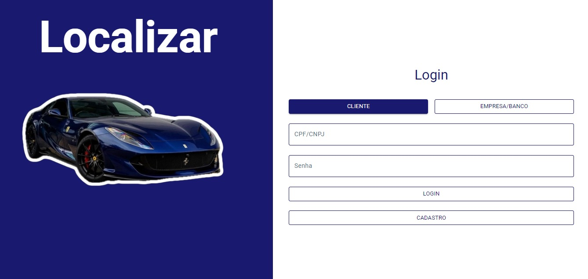
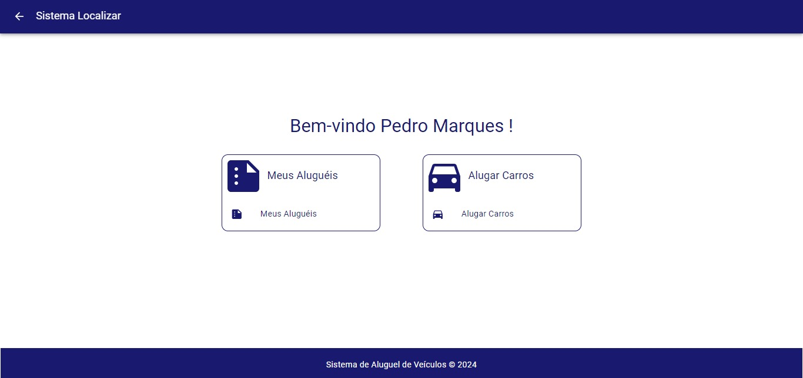
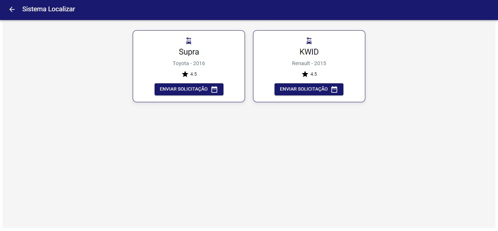
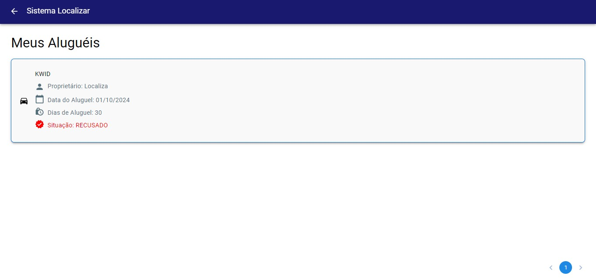
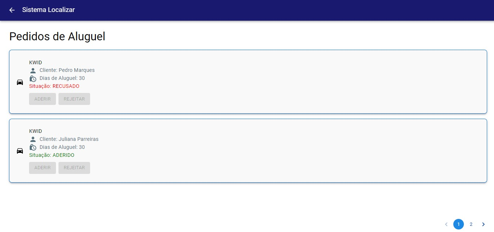

<div align="center">

<h1 align="center">🚗 Projeto de Aluguel de Carros 🚗</h1>


### Este repositório contém o trabalho em grupo realizado para a disciplina "Laboratório de Desenvolvimento de Software", do 4º período do curso de Engenharia de Software da PUC - Minas.

</div>

## Apresentação

Preview de algumas das telas do nosso sistema! 🏃

1. **Tela de Login**  
     

2. **Home**  
     

3. **Lista de Veículos**  
     

4. **Meus Aluguéis**  
     

5. **Meus Pedidos**  
     

## Integrantes

* Juliana Parreiras
* Pedro Henrique Marques
* Lúcio Alves
* Luidi Cadete Silva 

## Professor

* João Paulo Carneiro Aramuni

## Bem-vindo ao projeto de desenvolvimento do Sistema de Aluguel de Carros

Nosso objetivo é criar uma solução informatizada para facilitar a gestão de locação de veículos.

## Objetivo do Projeto

Desenvolver um sistema completo para automatizar o processo de aluguel de carros, oferecendo:

- Cadastro e gestão de veículos.
- Processo de reserva de veículos.
- Controle de disponibilidade.
- Cadastro de empresas.
- Cadastro de clientes.

## Descrição do Sistema

O Sistema de Aluguel de Carros permitirá:

- Cadastro e manutenção de veículos disponíveis para locação.
- Processo de reserva.
- Visualização de reservas ativas e histórico de locações.

## Tecnologias Utilizadas

- **Frontend**: React
- **Backend**: Spring Boot (Java)
- **Banco de Dados**: MySQL

## Orientações para Abrir o Projeto

### Pré-requisitos

Certifique-se de ter os seguintes programas instalados:

- **Node.js** (para rodar o frontend React)
- **MySQL** (para o banco de dados)
- **IntelliJ IDEA** (para rodar o backend Spring Boot)
- **Postman** ou **Swagger** (para testar a API)

### Passo a Passo

1. **Configurar o Banco de Dados**:
   - Instale o MySQL e crie um banco de dados chamado `aluguel_carros`.
   - Rode o script de criação das tabelas presente no diretório `Back/src/main/resources/schema.sql`.

2. **Configurar o Backend**:
   - Abra o projeto backend no IntelliJ IDEA.
   - Configure o arquivo `application.properties` em `Back/src/main/resources`, ajustando as configurações do banco de dados (usuário, senha e URL do banco).
   - Execute o backend no IntelliJ IDEA.

3. **Configurar o Frontend**:
   - Navegue até a pasta `Front/` e instale as dependências do projeto:
     ```bash
     Yarn install
     ```
   - Execute o frontend:
     ```bash
     Yarn start
     ```
   - O frontend estará acessível no navegador através de `http://localhost:3000`.

4. **Testar a API**:
   - Use o Swagger para testar a API acessando `http://localhost:8080/swagger-ui.html` (ou use o Postman para testar as requisições HTTP).

### Observações

1. Certifique-se de que o backend está rodando antes de executar o frontend para garantir que as APIs funcionem corretamente.
2. Para testes e acesso à base de dados, você pode usar ferramentas como MySQL Workbench ou o próprio console do MySQL.
3. O sistema de autenticação permite diferentes perfis de usuários, como administrador e clientes, com permissões específicas para cada um.

